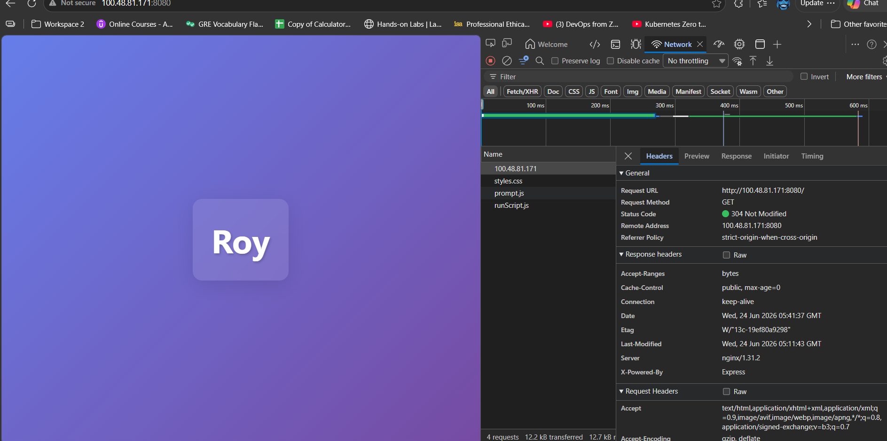
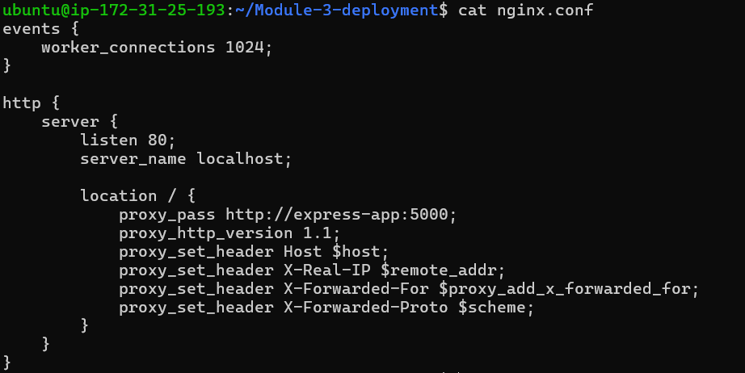
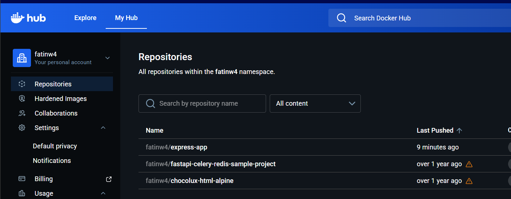
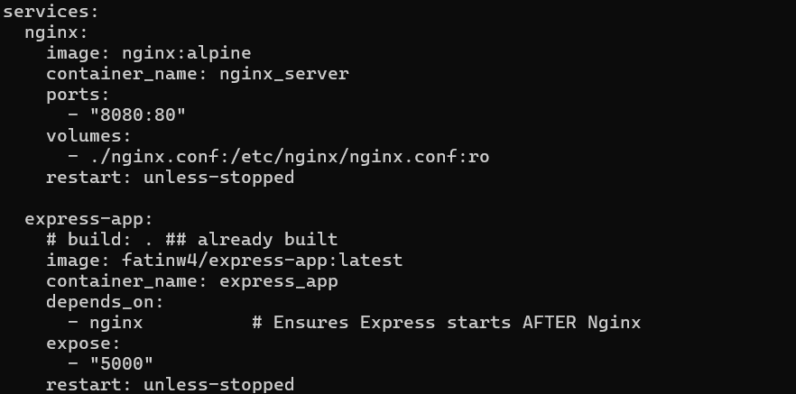
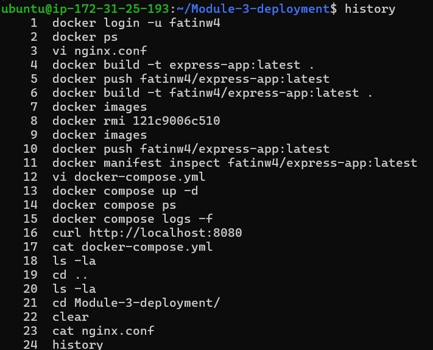

# Dockerizing ExpressJS-Nginx Application

## 📑 Table of Contents
- [📖 Overview](#-overview)
- [⚙️ Setup Steps](#-setup-steps)
- [🛠️ Configuration Steps](#-configuration-steps)
  - [Docker Permissions (Non-Root)](#docker-permissions-non-root)
  - [Nginx conf](#nginx-conf)
- [📸 Screenshots](#-screenshots)
- [📝 Notes](#-notes)


---

## 📖 Overview
This project is a Node.js Express application containerized with Docker and deployed using Docker Compose. It uses Nginx as a reverse proxy to handle incoming requests on port 8080 and forwards them to the Express backend running internally on port 5000. The application image is hosted on Docker Hub and deployed to an AWS EC2 Ubuntu instance, demonstrating a production-like containerized deployment setup.
---

## ⚙️ Setup Steps
```bash
# Update package index
sudo apt-get update -y

# Install prerequisite packages
sudo apt-get install ca-certificates curl gnupg lsb-release -y

# Add Docker’s official GPG key
sudo install -m 0755 -d /etc/apt/keyrings
sudo curl -fsSL https://download.docker.com/linux/ubuntu/gpg -o /etc/apt/keyrings/docker.asc
sudo chmod a+r /etc/apt/keyrings/docker.asc

sudo tee /etc/apt/sources.list.d/docker.sources <<EOF
Types: deb
URIs: https://download.docker.com/linux/ubuntu
Suites: $(. /etc/os-release && echo "${UBUNTU_CODENAME:-$VERSION_CODENAME}")
Components: stable
Architectures: $(dpkg --print-architecture)
Signed-By: /etc/apt/keyrings/docker.asc
EOF

# Install Docker Engine
sudo apt-get update -y
sudo apt install docker-ce docker-ce-cli containerd.io docker-buildx-plugin docker-compose-plugin
sudo systemctl status docker
```

---

## 🛠️ Configuration Steps

### Docker Permissions (Non-Root)
```bash
# Add current user to the docker group
sudo usermod -aG docker $USER

# Apply the new group membership immediately
newgrp docker

# Verify Docker runs without sudo
docker ps
```

### Docker Compose Services
* express-app: Node.js application running on port 5000
* nginx: Reverse proxy forwarding requests to express-app

```

### Nginx conf
```bash
events {
    worker_connections 1024;
}

http {
    server {
        listen 80;
        server_name localhost;

        location / {
            proxy_pass http://express-app:5000;
            proxy_http_version 1.1;
            proxy_set_header Host $host;
            proxy_set_header X-Real-IP $remote_addr;
            proxy_set_header X-Forwarded-For $proxy_add_x_forwarded_for;
            proxy_set_header X-Forwarded-Proto $scheme;
        }
    }
}

```


---


## 📸 Screenshots
### 1. Application


### 2. Dockerfile


### 3. Nginx


### 4. DockerHub


### 5. Docker Compose


### 6. Commands



---

## 📝 Notes
Nginx proxies requests to express-app:5000 (Docker network service name)
Express app is not directly exposed to the host (only accessible via Nginx)
Image available at Docker Hub